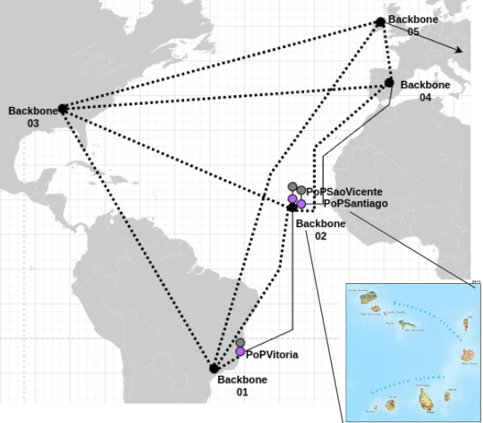
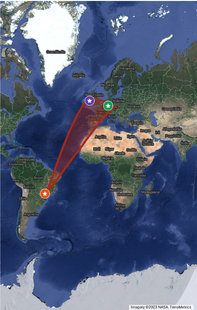
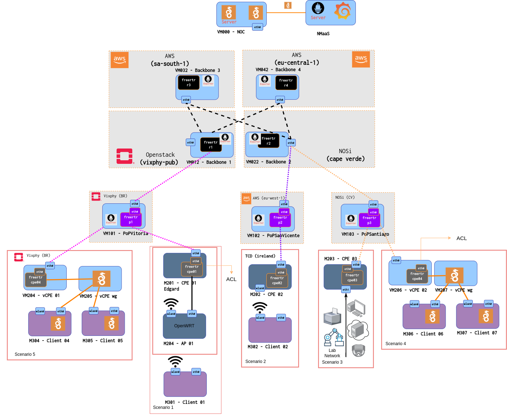
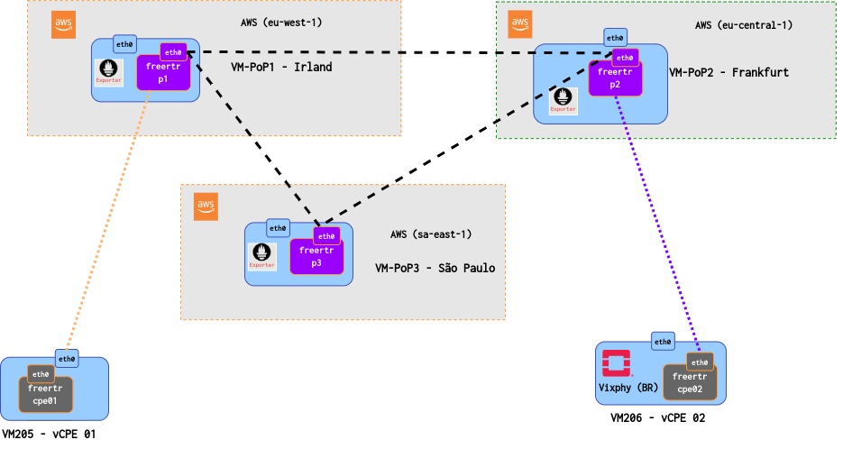
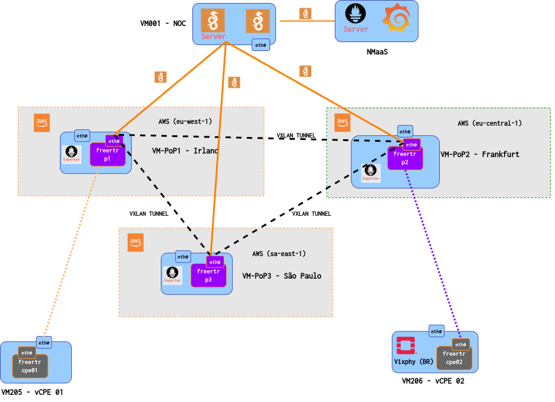

    <h1> Demo TNC 2023 RENaaS </h1>

- <b> Repository for the RENaaS DEMO proposal at the TNC Géant 2023 event.  </b>

 <h1> Overview </h1> 

 - ## What is RENaaS

    - Creates a robust and reliable National Research and Education Network (NREN) infrastructure that supports research and education activities Uses mix of commodity hw, private and public cloud.
 
    - A template for the establishment of NRENs in developing nations through the virtualization of infrastructure and the dynamic configuration of network services
    Proves the principles in Cape Verde, a nation of 10 islands located off the coast of West Africa, with basic and enhanced NREN services.

    

     
    

   
 - ## Link to the presentation
    - [Presentation on Google Slides](https://docs.google.com/presentation/d/14JEPBl9vxweXi5v-pm9ugdk3EK84QPI_l1OCnwR0l7g/edit?usp=sharing)

 <h1> Topology on Map </h1> 

    

        <h3> Brazil 🇧🇷 - 1 PoP - 2 clients </h3>
        <h3>  Frankfurt 🇩🇪 - 1 PoP </h3>
        <h3> Ireland  🇮🇪- 1 PoP </h3>
        <h3 > The focus of this demonstration is to present an overlay network with 2 clients and 3 PoPs around the world, highlighting features such as: access security and latency optimized routing. </h3>
    

    

        <!-- Sua imagem aqui -->
        
    

 

 <h1> Topology RENaaS </h1> 

   

 

 <h1> Proposed Topology Architecture </h1> 

 

 <h1> Monitoring Topology </h1> 

 

 <h1> Demo Road Map </h1> 

- ### 1 - Deploy PoP in AWS
- ### 2 - Install freeRouter in AWS
- ### 3 - Configuration Tunnels VXLAN in PoP’s
- ### 4 - Configuration Monitoring Tunnels wireguard
- ### 5 - Test 1: Monitoring PoP with NMaaS (Prometheus + Grafana)
- ### 6 - Test 2: A Python script automates the creation of VXLAN/Monitoring tunnels between PoPs

 <h1> DEMO in AWS </h1> 

-    At the beginning we have the complete RENaaS architecture without the proper connections configured, but for this presentation we will make an abstraction of the RENaaS architecture. For this Demo, we rely on an abstraction of the RENaaS architecture in AWS.

 <h1> Deploy PoP in AWS </h1> 

- Creating a Debian virtual machine on AWS for the experiment for this demo.
- SSH port (22) released.
- Access to the machine.

- [Link to the demo](https://drive.google.com/file/d/1pwv8hBb-K9sOxG-CneGsl0vrf9m7nAfb/view?usp=sharing)

 <h1> Install freeRtr </h1> 

- Install freeRouter.
- [Link to the demo](https://drive.google.com/file/d/1_NjB5e1MDBQmGPMsL45143uzNAUDLyBi/view?usp=sharing)

 <h1> Creating VXLAN tunnel from PoP Ireland to PoP Frankfurt </h1> 

- In this video, it is demonstrated how to set up a VXLAN tunnel from a PoP in Ireland to a PoP in Frankfurt, the routing is done via OSPF.

- [Link to the demo ](https://drive.google.com/file/d/1nSkK5Oa6L_jz2s-IOcdnwSZDFB54Q0Uk/view?usp=sharing)

 <h1> Creating a wireguard tunnel for monitoring </h1> 

-  Wireguard keys generation and configuration;
- Creating wireguard tunnel in the PoP;
- Opening port 51820 on AWS;
- PoP visibility in NMaaS.

- [Link to the demo ](https://drive.google.com/file/d/1belAJlop6GWfmrILtvL6KmWCuw961WWE/view?usp=sharing)

 <h1> Visibility Demo with NMaaS Monitoring  </h1> 

- The whole infrastructure can be monitored through the Prometheus + Grafana services hosted by NMaaS (Géant).
- Each RARE/freeRtr node exporters the monitored metrics through a wireguard tunnel.

- [Link to the demo](https://drive.google.com/file/d/1w6twr3OhjgHtkjI7UpM6FLaYZiSzZmM4/view?usp=sharing)

 <h1> RARE/freeRtr deployment automation </h1> 

- All videos with the configurations performed so far were made manually. To automate this process, was developed a Python script with.

- To automate this process, a script was developed using the Python language with all the settings presented.

- [Link to the demo](https://drive.google.com/file/d/1_cBq7fGZQvw03dNsTTI0TFwCR8CyXkBR/view?usp=sharing)

 <h1> Automation Script </h1> 

- [Scripts](scripts/freertr/readme.md)

 <h1> Find out more </h1> 

- ## Link to Geant Innovation Programme showcase
    - https://wiki.geant.org/pages/viewpage.action?pageId=611057894
    - Slides 1 https://geant.app.box.com/s/i5vr9voghztzm7w4xaf1bd4op8v7uwj7
    - Slides 2 https://geant.app.box.com/s/ewf8j2o8sopozg4a370zks96goffrq8w 

- ## Link to FreeRtr and NMaaS projects
    - http://www.freertr.org/
    - https://github.com/rare-freertr/freeRtr
    - https://nmaas.eu/
    - https://network.geant.org/nmaas/

- ## Who to contact
    - Frank Slyne, Trinity College Dublin (TCD), e-mail: fslyne@tcd.ie
    - Gabriel Tetzner Menegueti, Federal University of Espírito Santo (UFES), e-mail: gabriel.menegueti@edu.ufes.br
